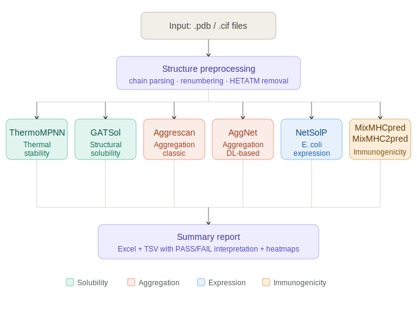

# Protein Candidate Screener

A batch analysis pipeline that evaluates protein/antibody candidates across multiple biophysical properties from PDB/CIF structure files.

## Overview

Given a set of protein structure files, this pipeline automatically runs 6 analysis tools in sequence and generates a unified report with PASS/FAIL interpretation for each candidate.

**Evaluated properties:**
- **Thermal stability** — ThermoMPNN (ddG, kcal/mol)
- **Structural solubility** — GATSol (probability)
- **Aggregation propensity** — Aggrescan (Na4vSS, nHS, AAT) + AggNet (APR count/fraction, peak score)
- **E. coli expression solubility & usability** — NetSolP (solubility + usability probability)
- **Immunogenicity** — MHC-I (HLA-A/B/C alleles) and MHC-II (HLA-DRB1 alleles) via sliding-window %Rank

## Pipeline Architecture



## Acceptance Criteria

| Metric | Direction | Threshold |
|--------|-----------|-----------|
| Stability_ddG | lower is better | < 0.0 kcal/mol |
| Solubility (GATSol) | higher is better | > 0.5 |
| Aggrescan_Na4vSS | lower is better | < 0.0 |
| Aggrescan_nHS | lower is better | < 5 |
| AggNet_APR_frac | lower is better | < 0.05 |
| NetSolP_Sol | higher is better | > 0.5 |
| MHC-I/II avg %Rank | higher is better | > 40 |

## Example Output

Results are saved as Excel and TSV with inline PASS/BORDERLINE/CAUTION/FAIL interpretation per metric.

| ID   | Stability_ddG | Solubility (GATSol) | Aggrescan_Na4vSS | AggNet_APR_frac | NetSolP_Sol | MHC-I (HLA-A02:01) | MHC-II (DRB1_03_01) |
|------|--------------|---------------------|-----------------|-----------------|-------------|---------------------|----------------------|
| 9I6Q | -0.007 (PASS) | 0.522 (PASS) | -9.27 (PASS) | 0.228 (FAIL) | 0.358 (CAUTION) | 39.9 (CAUTION) | 50.9 (PASS) |
| WT   | -0.005 (PASS) | 0.487 (BORDERLINE) | 29.76 (FAIL) | 0.405 (FAIL) | 0.289 (FAIL) | 36.4 (CAUTION) | 49.0 (PASS) |

A heatmap visualization is also generated for quick visual comparison across candidates.

## Requirements

> **Note:** This pipeline assumes each tool is already installed and functional in its respective conda environment. Installation of individual tools can be complex and is outside the scope of this repository — please refer to each tool's own README for setup instructions. The role of this pipeline is to orchestrate the tools, parse their outputs, and consolidate results into a unified report.

Each tool runs in its own conda environment. Clone each repository and set up the corresponding environment before running the pipeline.

| Tool | Execution | Repository |
|------|-----------|------------|
| ThermoMPNN | conda env `thermoMPNN` | https://github.com/Kuhlman-Lab/ThermoMPNN |
| GATSol | conda env `GATSol` | https://github.com/binbinbinv/GATSol |
| Aggrescan | python3 direct | Custom implementation based on Conchillo-Sole et al. (2007) |
| AggNet | conda env `AggNet` | https://github.com/Hill-Wenka/AggNet |
| NetSolP | conda env `netsolp` | https://github.com/TviNet/NetSolP-1.0 |
| MixMHCpred (MHC-I) | dedicated Python env | https://github.com/GfellerLab/MixMHCpred |
| MixMHC2pred (MHC-II) | dedicated Python env | https://github.com/GfellerLab/MixMHC2pred |

Once all tools are installed, update the `CONFIG` block at the top of `master_batch_analysis.py` to match your local paths:

```python
CONFIG = {
    "INPUT_DIR":    "/path/to/your/input/pdb_files",
    "THERMO_ROOT":  "/path/to/ThermoMPNN",
    "GATSOL_ROOT":  "/path/to/GATSol/Predict",
    "MHC_ROOT":     "/path/to/MixMHCpred",
    "MHC_PY":       "/path/to/mhc1_env/bin/python3",
    "AGGRESCAN_PY": "/path/to/aggrescan/aggrescan.py",
    "AGGNET_ROOT":  "/path/to/AggNet",
    "NETSOLP_ROOT": "/path/to/NetSolP/PredictionServer",
    "CONDA":        "/path/to/miniconda3/condabin/conda",
}
```

Python dependencies for the main script: `biopython`, `pandas`, `matplotlib`, `seaborn`, `openpyxl`

## Usage

1. Place input `.pdb` or `.cif` files in the input directory
2. Update `INPUT_DIR` in the `CONFIG` block of `master_batch_analysis.py` to point to that directory
3. Optionally name the reference/wildtype file with a tag: `WT`, `ref`, `test`, or `01`
4. Run:

```bash
python3 master_batch_analysis.py
```

Output is saved to a timestamped folder with the following structure:

```
output_YYYYMMDD_HHMMSS/
├── 01_ThermoMPNN/
├── 02_GATSol/
├── 03_MHC/
├── 04_AGGRESCAN/
├── 05_AggNet/
├── 06_NetSolP/
└── Summary/
    ├── Final_Assembly_Report.xlsx
    ├── Final_Assembly_Report.tsv
    ├── Final_Assembly_Report_raw.tsv
    └── Visualizations/
```

## References

| Tool | Citation |
|------|---------|
| ThermoMPNN | Dieckhaus et al. (2024). Transfer learning to leverage larger datasets for improved prediction of protein stability changes. *PNAS*, 121(6), e2314853121. https://doi.org/10.1073/pnas.2314853121 |
| GATSol | Li & Ming (2024). GATSol, an enhanced predictor of protein solubility through the synergy of 3D structure graph and large language modeling. *BMC Bioinformatics*, 25, 204. https://doi.org/10.1186/s12859-024-05820-8 |
| Aggrescan | Conchillo-Sole et al. (2007). AGGRESCAN: a server for the prediction and evaluation of "hot spots" of aggregation in polypeptides. *BMC Bioinformatics*, 8, 65. https://doi.org/10.1186/1471-2105-8-65 |
| AggNet | He et al. (2025). AggNet: Advancing protein aggregation analysis through deep learning and protein language model. *Protein Science*, 34(2), e70031. https://doi.org/10.1002/pro.70031 |
| NetSolP | Thumuluri et al. (2022). NetSolP: predicting protein solubility in Escherichia coli using language models. *Bioinformatics*, 38(4), 941-946. https://doi.org/10.1093/bioinformatics/btab801 |
| MixMHCpred (MHC-I) | Gfeller et al. (2023). Improved predictions of antigen presentation and TCR recognition with MixMHCpred2.2 and PRIME2.0 reveal potent SARS-CoV-2 CD8+ T-cell epitopes. *Cell Systems*, 14, 72-83. https://doi.org/10.1016/j.cels.2022.12.002 |
| MixMHC2pred (MHC-II) | Racle et al. (2019). Robust prediction of HLA class II epitopes by deep motif deconvolution of immunopeptidomes. *Nature Biotechnology*, 37(11), 1283-1286. https://doi.org/10.1038/s41587-019-0289-6 |
